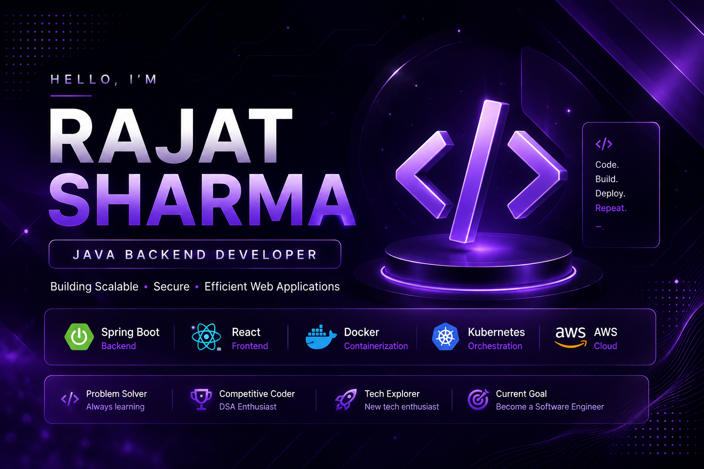

<p align="center">
  
</p>

---

<div align="center">

# 👋 Hi, I'm Rajat Sharma

### Java Backend Developer | Full Stack Developer

💻 **B.Tech CSE Student**

🌱 Learning **Spring Boot • React • Docker • Kubernetes**

🚀 Passionate about **Backend Development & DSA**

📍 India

</div>

<div align="center">

*"Building software that solves real-world problems."*

</div>

---

## 👨‍💻 About Me

```yaml
Name: Rajat Sharma

Education:
  - B.Tech Computer Science Engineering

Languages:
  - Java
  - C++
  - JavaScript

Currently Learning:
  - Spring Boot
  - React
  - Docker
  - Kubernetes
  - AWS

Interests:
  - Backend Development
  - Full Stack Development
  - Data Structures & Algorithms

Current Goal:
  - Become a Software Engineer
```

---

## 🚀 Tech Stack

<p align="center">

</p>

---

## 🚀 Featured Projects

| Project | Tech Stack | Status |
|---------|------------|--------|
| 🚇 **MetroAlert** | React • Spring Boot • Maps • Notifications | 📝 Planned |
| 🔍 **TraceBack** | Spring Boot • MongoDB • AWS S3 • React | ✅ Completed |
| 🏨 **StayScout** | React • REST API | ✅ Completed |


---

## 🌐 Coding Profiles

<p align="center">

<a href="https://leetcode.com/u/Rajat5225/">

</a>

<a href="https://www.codechef.com/users/rajat_5225">

</a>

<a href="https://github.com/Rajat52225">

</a>

</p>

---

## 📫 Connect With Me

<p align="center">

<a href="mailto:YOUR_EMAIL@gmail.com">

</a>

<a href="https://linkedin.com/in/YOUR_LINKEDIN">

</a>

<a href="https://github.com/Rajat52225">

</a>

</p>

---

<div align="center">

### ⭐ Thanks for visiting my profile!

If you like my work, consider giving a ⭐ to my repositories.

</div>
